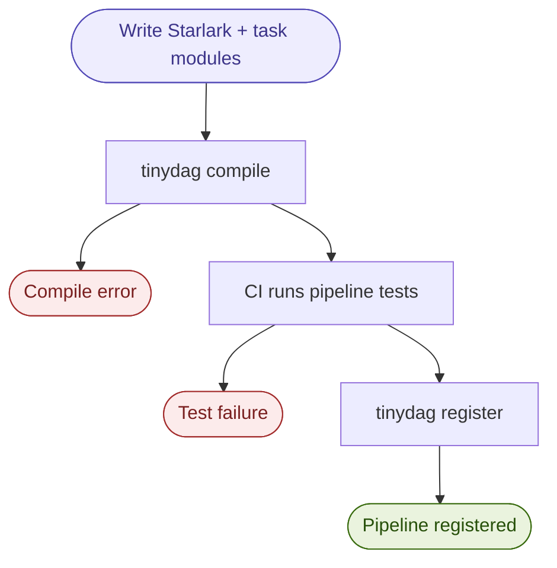
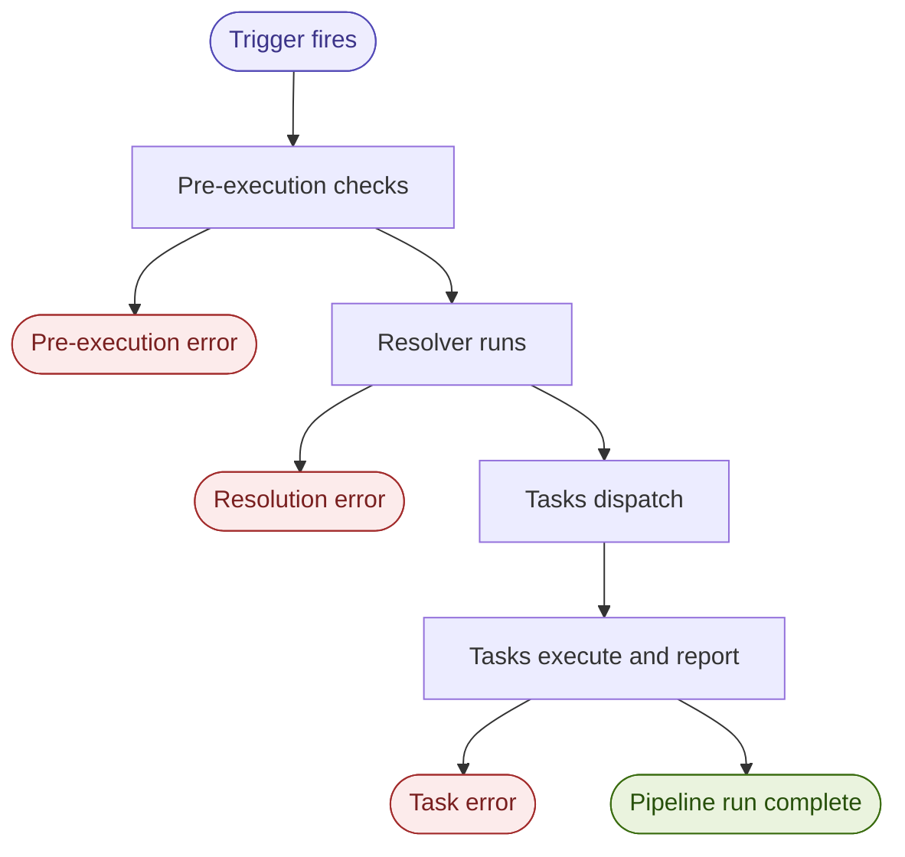

# tinydag Design

tinydag is an embedded-first, Rust-native DAG orchestrator designed to run *inside*
a larger system rather than *be* the system. It owns the graph, the ordering,
the state, and the dispatch; but not the compute. Most existing pipeline tools
(Dagster, Prefect, Airflow) assume they are the center of your infrastructure.
tinydag does not.

This document captures the current design thinking as a long list of ideas,
decisions and open topics. As the project matures, we will move to a formal
RFC process.

---

## Table of Contents

- [Positioning](#positioning)
- [Pipeline Lifecycle](#pipeline-lifecycle)
  - [Deployment lifecycle](#deployment-lifecycle)
  - [Execution lifecycle](#execution-lifecycle)
- [Core Design Decisions](#core-design-decisions)
  - [Fail Fast at Every Layer](#fail-fast-at-every-layer)
  - [Task Definition Language](#task-definition-language)
  - [Task Module Validation](#task-module-validation)
  - [Testing](#testing)
  - [Task Interface](#task-interface)
  - [IR Structure](#ir-structure)
  - [Static vs. Dynamic DAGs](#static-vs-dynamic-dags)
  - [Late-binding Inputs](#late-binding-inputs)
  - [Compile time checks](#compile-time-checks)
  - [Pre-execution](#pre-execution)
  - [Early execution](#early-execution)
  - [Inter-pipeline dependencies](#inter-pipeline-dependencies)
- [Architecture](#architecture)
  - [Execution Model](#execution-model)
  - [Scheduler](#scheduler)
  - [Observability](#observability)
  - [Multi-tenancy](#multi-tenancy)
  - [Security Model](#security-model)
- [Airflow Interoperability](#airflow-interoperability)
- [v1 Scope](#v1-scope)
- [Backfills](#backfills)
- [Testing Strategy](#testing-strategy)
- [Contributing](#contributing)

---

## Positioning

There is no tool that is: embedded-first, Rust-native, dependency-light,
and designed to run inside a larger system rather than be the system.
tinydag fills that gap.

### Landscape

| Tool | Notes |
|---|---|
| Airflow | The dominant pipeline platform. Heavy, complex, dynamic-DAG-first. The baseline most users are coming from. |
| Dagster | Full platform, asset-centric, good local dev story. Too heavy. |
| Prefect | More Pythonic than Airflow, dynamic DAGs, hybrid execution. Still heavy. |
| Hatchet | General-purpose task orchestration platform. Go-based. Closest in spirit but diverging toward AI agent workloads. |
| Luigi | Older, minimal. Closest in philosophy. |
| Dagger.io | CI/CD pipelines as code, different domain. |

---

## Pipeline Lifecycle

### Deployment lifecycle

> **Note:** This section is a placeholder and will be expanded later.

tinydag uses CI/CD as the gate for pipeline registration. A pipeline goes
live when it passes CI, not when it is first scheduled to run.

The typical flow:

1. User lands a diff containing a new or changed Starlark file
2. CI compiles the pipeline: `tinydag compile pipeline.star`
3. CI runs pipeline-level tests: `pytest test_pipeline.py`
4. On success, CI registers the compiled IR with the scheduler:
   `tinydag register pipeline.star`
5. The scheduler picks up the new version; the next trigger runs it

If compilation or tests fail, the pipeline never reaches the scheduler.



### Execution lifecycle

## Core Design Decisions

### Fail Fast at Every Layer

**The primary value of pipeline compilation is moving runtime failures to compile time.**

```
Compile time -> Pre-execution -> Early execution
     |                |                |
 Structural        Data           Logic/runtime
 Contract       availability        errors
 Reference         SLAs          (unavoidable)
```

### Task Definition Language

**Python is the user-facing DSL.**

The architecture is a compilation pipeline:

```
Python DSL -> Parser -> IR -> Orchestrator
                              ^
External systems  ------------|
```

The Python layer is a configuration language, not an execution environment.
Users define pipelines in Python; tinydag parses that into an intermediate
representation (IR) and the orchestrator never sees raw Python.
This means users cannot interact with or affect the orchestrator from their
pipeline code.

**Reference:** Starlark (used by Bazel) is a restricted Python dialect designed
for exactly this use case. It's deterministic, no side effects, no imports,
sandboxed. Worth studying as a reference for what restrictions to impose on
the parser.

External systems can submit IR directly, bypassing the Python DSL entirely.

### Task Module Validation

At compile time, tinydag attempts to import every callable reference declared in
the IR. A malformed module, broken import, or missing function is caught here.

**Validation modes:**

- **Strict (v1 default):** imports callable in local Python environment.
  Compilation fails if any callable cannot be imported. Appropriate for the
  local executor and development environments.
- **Container:** imports callable inside the execution container image
  locally. Same strictness as strict mode but validates against the actual
  execution environment. Requires Docker at compile time. Slower and more
  expensive but catches environment mismatches.
- **Manifest-based (v2, maybe):** the execution environment publishes a manifest
  of available callables; tinydag validates against that instead of importing
  directly. Decouples validation from the local environment entirely.
- **Warn:** skips validation and emits a warning. Escape hatch only.

### Testing

tinydag has two distinct levels of testing, both first-class and supported
out of the box via a `tinydag.testing` module.

**Task-level tests**: plain pytest, no tinydag involved. Because task
modules have zero tinydag imports, they test like any other Python code:

```python
# test_mymodule.py
from mymodule import clean

def test_clean():
    assert clean([1, 2, 3]) == 2.0
```

**Pipeline-level tests**: tinydag compiles the Starlark file and exposes
the result for assertion. Structure, contracts, and callable references are
all validatable:

```python
# test_pipeline.py
from tinydag.testing import compile

def test_pipeline_structure():
    dag = compile("pipeline.star")
    
    # Topology
    assert dag.depends_on("clean", "extract")
    assert not dag.depends_on("extract", "clean")  # not the other way around
    assert len(dag.tasks) == 2  # no accidental extra tasks
    
    # Task references point where we expect
    assert dag.task("extract").callable == "mymodule.extract"
    assert dag.task("clean").callable == "mymodule.clean"
    
    # Scheduling intent
    assert dag.schedule == "0 * * * *"
    assert dag.task("extract").timeout == 300


```

Pipeline-level tests are a capability but not a requirement. The compiler does
the heavy lifting: contracts, references, and structure are validated on
every `compile()` call. The testing module is for teams that need to go
further:

- **Large pipelines:** 20, 30, 50+ tasks where topology is hard to reason
  about by reading the Starlark file alone
- **Frequently changing pipelines:** catches regressions when someone
  modifies a pipeline they didn't originally write
- **Critical pipelines:** where a miswired dependency causes downstream
  data corruption or missed SLAs; the cost of a bug justifies the overhead
- **Team environments:** tests serve as documentation of intent as much as
  correctness checks when multiple people touch the same pipeline definitions

### Task Interface

Pipeline structure, task wiring, and metadata are declared in the Starlark
file. Task logic lives in plain Python modules with no tinydag imports.

```python
# pipeline.star
pipeline = DAG("my_pipeline", schedule="0 * * * *")

with pipeline:
    raw = PythonOperator(
        task_id="extract",
        python_callable="mymodule.extract",
        inputs=[],
        outputs=["raw_data"]
    )

    cleaned = PythonOperator(
        task_id="clean",
        python_callable="mymodule.clean",
        inputs=["raw_data"],
        outputs=["clean_data"]
    )

    raw >> cleaned
```

```python
# mymodule.py - plain Python, no tinydag imports
import numpy as np

def extract():
    ...

def clean(raw_data):
    return np.array(raw_data).mean()
```

The Starlark file holds only string references to callables. tinydag resolves
those references at compile time but never executes them. Execution happens
in the task runtime, which is plain Python with no restrictions. This means
task code can be tested with plain pytest, run locally without tinydag
installed, and migrated away from tinydag without touching task modules.

**Open question: dependency declaration syntax**

For small pipelines, declaring dependencies inline with `depends_on` is
readable. For larger pipelines, a dedicated dependency block separating
structure from operator definitions scales better:

```python
dependencies = [
    extract >> clean,
    clean >> [enrich, validate],
    enrich >> aggregate,
    validate >> aggregate,
]
```

The right syntax for tinydag is an open question. It should be readable at
scale and make the topology of the pipeline visible without having to read
every operator definition. Feedback welcome.

### IR Structure

The IR captures graph structure and execution contracts, not task logic. Task
logic is the user's responsibility.

Fields:

- Node ID
- Task reference: a tagged union where the operator type determines valid fields
  - `python`: callable reference, inputs, outputs
  - `bash`: command string
  - `sql`: connection reference, query
  - `s3`: source, destination
  - `http`: url, method, headers, body
  - `kubernetes`: image, command, resources
- Inputs / outputs (names + types)
- Execution metadata (retries, timeout, etc.)
- Trigger definition
- Owner (team / user)
- Inter-pipeline dependency declarations

Triggers are a first-class field in the IR. Every pipeline declares how it
is activated: `cron`, `event`, `manual`, or `pipeline_completion`.

With `pipeline_completion` a pipeline wakes dependents when it succeeds and
notifies them when it fails.

The trigger type is carried in every telemetry event, so it is always clear
whether a run was scheduled, manually triggered, or woken by an upstream
pipeline.

The IR is serialized as **Protobuf**. A version hash is baked into every IR so that
when a DAG definition changes, it is a new version. Runs in flight belong to the
version they started on.

### Static vs. Dynamic DAGs

> **Note:** The designs in this section are very early and speculative. The core
> principle is that static DAGs are always preferred (with clearly documented
> escape hatches), but the specific mechanisms (late-binding, resolvers, unsafe mode)
> are not yet finalized and will evolve with user input.

*Dynamic DAGs: here be dragons.*

The core principle is: almost every dynamic DAG is convertible to a static one, with some work. 
tinydag identifies common dynamic DAG scenarios and provides static solutions upfront.
For cases with no static solution, they are either declared out of scope or handled
via an explicit `unsafe` mode (TBD).

| Use Case | Static Solution |
|---|---|
| Parameterized pipelines (e.g. date partitions) | Static DAG + parameter injection at submission time |
| Fan-out over unknown inputs (e.g. files in a dir) | Pre-execution expansion via pipeline-level resolver; DAG structure is static, inputs are late-bound and resolved once before execution starts |
| Conditional branching | Static DAG with skip semantics on nodes |
| External system submitting pipelines | API that accepts a DAG definition, validates, then freezes it for execution |
| Retry with modified subgraph | New DAG submission, not mutation of running DAG |
| Recursive / iterate-until-convergence | Out of scope or `unsafe` mode |

---

#### Late-binding Inputs

For cases where inputs cannot be known at compile time (e.g. a directory of
files, a partition list, an API response), tinydag supports late-binding via
a pipeline-level resolver.

The resolver is a plain Python function declared on the DAG and called once
by tinydag at dispatch time, before any task runs. It returns a dictionary
of resolved values that late-bound inputs are keyed into:

```python
# pipeline.star
pipeline = DAG(
    "my_pipeline",
    schedule="0 * * * *",
    resolver="resolvers.resolve"
)

with pipeline:
    process = PythonOperator(
        task_id="process_file",
        python_callable="mymodule.process",
        inputs=late("files"),
        outputs=["result"]
    )
```

```python
# resolvers.py - plain Python, no restrictions
import boto3

def resolve(ctx):
    s3 = boto3.client("s3")
    objects = s3.list_objects(Bucket="my-bucket", Prefix="input/")
    return {
        "files": [obj["Key"] for obj in objects["Contents"]]
    }
```

tinydag calls the resolver once, validates that all declared `late()` keys
are present in the output, and proceeds to execution with fully resolved
inputs. If the resolver fails, the pipeline never starts and the error is
clearly attributable to the resolution phase.

The resolver follows the same compile-time validation rules as task modules:
the callable reference is validated at compile time, not at runtime.

**Known limitations:**

- Single point of failure with no granularity: if the resolver fails, the
  entire pipeline is blocked regardless of which input caused it
- Resolver complexity grows with pipeline complexity as more late-bound
  inputs are added
- All-or-nothing: if one input cannot be resolved, tasks that don't depend
  on it are still blocked
- No parallelism: resolution is sequential regardless of how many inputs
  need resolving
- Testing requires mocking all external systems the resolver touches

These tradeoffs are acceptable for v1.

### Compile time checks

- Structural errors: cycles, disconnected nodes, missing dependencies
- Contract mismatches: output type of node A does not match declared input of node B
- Missing task references: callable, script, or container does not exist
- Parameter errors: required params missing or wrong type
- Scope violations: Python DSL doing things it should not (imports, side effects, system calls)

Input/output contract declarations are a core requirement for any operator.
Without them, only structural errors can be caught at compile time.

### Pre-execution

A validation pass runs after compilation but before any task starts, checking
preconditions: e.g. partition exists, upstream table has landed, SLA window is open.
If any precondition fails, the pipeline never starts and dependents are notified.
Users declare preconditions explicitly and tinydag does not infer them.
Inference would require tinydag to understand the semantics of your data
stores and inputs, which is domain knowledge that belongs to the user, 
or another tool.

Preconditions are plain Python functions that return a boolean. tinydag
provides the interface and users implement them:

```python
# preconditions.py - plain Python, no tinydag imports
def my_table_ready(ctx):
    return check_partition_exists("my_table", ctx.execution_date)
```

```python
# pipeline.star
pipeline = DAG(
    "my_pipeline",
    schedule="0 * * * *",
    preconditions=["preconditions.my_table_ready"]
)

# Explicitly none: a conscious decision, not an oversight
pipeline = DAG(
    "my_pipeline",
    schedule="0 * * * *",
    preconditions=none()
)
```

A pipeline with neither preconditions declared nor `preconditions=none()`
produces a compile-time warning.

### Early execution

Some errors are unavoidable at compile time and can only be caught during
execution: runtime data errors, bad values, schema drift, external system
failures, and logic errors inside task code. tinydag does not check these
directly. They surface through task-level telemetry as structured errors,
giving the user enough context to understand what failed and where.

### Inter-pipeline dependencies

A very common failure mode in data warehouses: a pipeline reaches a task where
the upstream partition for that day has not landed yet. The pipeline should fail
immediately and notify all downstream dependents, instead of hanging or retrying
indefinitely.

This requires a registry of inter-pipeline dependencies and a notification
mechanism. The IR has a dedicated field for inter-pipeline dependency declarations
from day one, even if v1 does not enforce them.

---

## Architecture

### Execution Model

tinydag is a dispatch and telemetry system, not a compute system.
It owns the graph, the ordering, the state, and the dispatch. It does not run
tasks, it dispatches them to an execution backend and receives telemetry back.

- v1: local executor runs tasks as subprocesses on the same machine, for
development and small deployments
- v2+: remote backends (Kubernetes jobs, Lambda functions, any system that can
accept a dispatch payload and emit telemetry)
- tinydag is backend-agnostic, i.e. the IR carries enough metadata to generate
the dispatch payload for any target

### Scheduler

tinydag ships with a high-performance embedded scheduler that can be swapped out.
If you have existing scheduling infrastructure, you can ignore it and trigger
tinydag externally via the API. The scheduler is not required, but it is fast
and has no external dependencies.

**Design philosophy:** most pipeline schedulers are slow because they treat
scheduling as a database problem. tinydag's scheduler runs fully in memory,
snapshotting to disk for resiliency. The working set of an active scheduler
comprises runs in flight, pending tasks, trigger timers and is small enough to
fit comfortably in memory even for large deployments. This means scheduling
decisions happen in microseconds, and the latency between "task A completes" and
"task B is dispatched" is essentially zero.

The goal is to run very large systems from a single box, with a warm standby for
failover instead of sharding and adding complexity. A well-designed in-memory
system can go much further than most teams expect before sharding becomes
necessary.

### Observability

**OpenTelemetry out of the box. No built-in UI.** Users bring their own observability
tooling (Grafana, Honeycomb, Datadog, etc.).

Task-level telemetry is the primary unit. Pipeline-level status is a derived view,
not the source of truth.

Every meaningful state transition is emitted as a structured event:

- Task dispatched
- Task started (with execution context)
- Task progress (optional hook)
- Task succeeded (with outputs, duration)
- Task failed (with structured error: machine-readable type, message, and context)
- Task skipped (with reason)
- Task timed out
- Task retried (with attempt number and backoff)

Every event carries: pipeline ID, DAG version, run ID, team/user, task ID,
trigger type.

### Multi-tenancy

Team and user are first-class fields in the IR and in every telemetry event.
Retrofitting tenancy is painful.

### Security Model

Delegated to the execution system for v1. tinydag trusts that what it dispatches
runs in an isolated environment. This is an explicit, documented boundary and
operators are responsible for execution isolation.

---

## Airflow Interoperability

Airflow is the most common pipeline system users may be migrating from.
Full Airflow compatibility is out of scope as it would require reimplementing
the Airflow runtime to support.

What is in scope is structural compatibility: parse an Airflow DAG file, extract
graph topology and task references, and import into tinydag IR.
This gives users a starting point for migration rather than a blank page.

---

## v1 Scope

### In

- Starlark pipeline DSL with `PythonOperator`
- Plain Python task modules with no tinydag imports
- Parser that compiles to Protobuf IR
- Structural validation at compile time (cycles, missing references, broken dependencies)
- Callable validation at compile time (strict mode by default)
- Explicit precondition functions required on every pipeline
- Pipeline-level resolver for late-bound inputs
- CI/CD as the deployment gate (`tinydag compile`, `tinydag register`)
- Local executor: runs tasks as subprocesses on the same machine, no remote dispatch
- Cron and manual triggers only
- Task-level telemetry via OpenTelemetry: structured events, structured errors,
  all metadata fields: run ID, pipeline ID, DAG version, team/user, task ID,
  trigger type
- `tinydag.testing` module shipped as part of core
- Single tenant

### Part of the design but out for v1

- Remote execution backends (k8s, Lambda)
- Event and pipeline_completion triggers
- Contract validation at edges (inputs/outputs)
- Pre-execution data availability checks beyond precondition functions
- Inter-pipeline dependencies
- Multi-tenancy enforcement
- Airflow migration tooling
- Retries
- Partial execution and resume
- Backfills
- Container-based and manifest-based callable validation modes
- `tinydag-preconditions` package

---

## Backfills

Backfills are a v2 feature. v1 supports scheduled and manual runs only.

A backfill is not "run this pipeline again for old dates", it is "run a
variant of this pipeline for a date range." That variant is a first-class
artifact, not a runtime flag. It goes through the same compilation pipeline
as any other DAG (parse → validate → IR → execute). The IR carries the date
range and a pointer to the original pipeline version it was derived from.

Users can specify pipeline modifications for a backfill: skipping tasks,
swapping implementations, changing parameters. The variant declaration is
also where the user specifies what happens to data that already exists.

Downstream pipelines are notified when a backfill run completes, same as
any other run.

---

## Testing Strategy

> **Note:** This section is a placeholder and will be expanded later.

**Realistic workloads:** try to simulate ML pipeline shapes including fan-out
preprocessing, convergent training steps, and conditional branches.

**Fault injection:** test panicking tasks, stalling tasks, dependency cycles,
and partial graph completion.

**Property-based testing:** use `proptest` or `quickcheck` to generate random
valid DAG topologies and verify ordering invariants.

**Benchmarking:** compare against other DAG platforms on a 100-node DAG across
three dimensions: cold-start latency, memory overhead, and throughput.

Other ideas? TBD

---

## Contributing

This project is in early design. The best way to contribute right now is to open
an issue with feedback on the design decisions above. As the project matures,
major changes will go through a formal RFC process.
