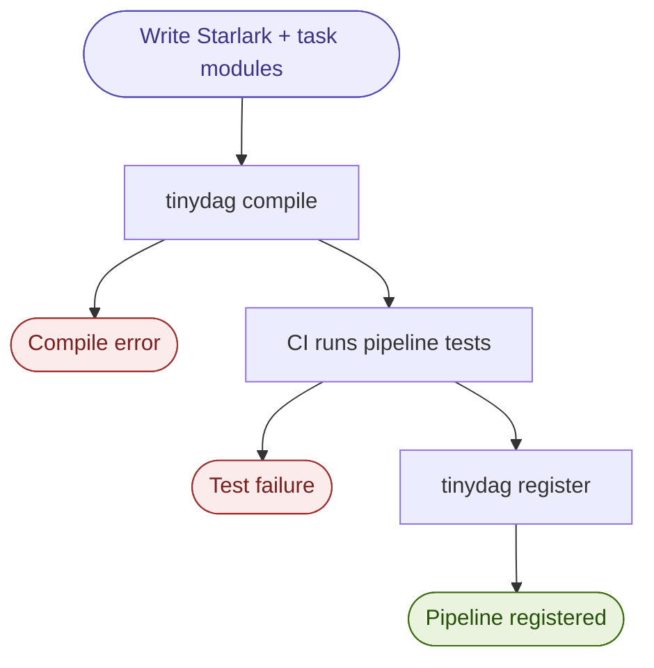
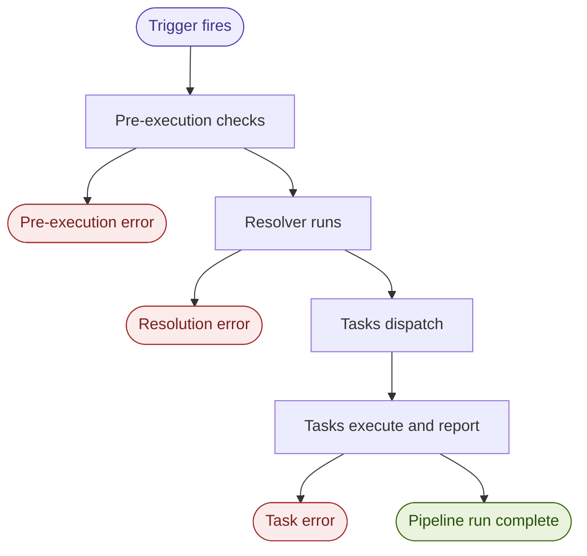

## Fail Fast at Every Layer

**The primary value of pipeline compilation is moving runtime failures to compile time.**

```
Compile time -> Pre-execution -> Early execution
     |                |                |
 Structural        Data           Logic/runtime
 Contract       availability        errors
 Reference         SLAs          (unavoidable)
```

## Pipeline Lifecycle

### Deployment lifecycle

> **Note:** This section is a placeholder and will be expanded later.

tinydag uses CI/CD as the gate for pipeline registration. A pipeline goes
live when it passes CI, not when it is first scheduled to run.

The typical flow:

1. User lands a diff containing a new or changed Starlark file
2. CI compiles the pipeline: `tinydag compile pipeline.star`
3. CI runs pipeline-level tests: `pytest test_pipeline.py`
4. On success, CI registers the compiled IR with the scheduler:
   `tinydag register pipeline.star`
5. The scheduler picks up the new version; the next trigger runs it

If compilation or tests fail, the pipeline never reaches the scheduler.



### Execution lifecycle


## Pre-execution validation

Pre-execution validation is a pass that runs after compilation and before
any task is dispatched. Its job is to catch failures that are:

- Cheap to check
- External to the pipeline
- Worth checking before consuming any execution resources

Two things run in this pass:

**User-declared preconditions.** Plain Python functions that return a
boolean. The pipeline author declares them explicitly. Examples: a partition
produced by an external system has landed, an upstream table exists, an SLA
window is open, an external API is reachable. tinydag does not infer
preconditions; absence of a declaration produces a compile-time warning,
and `preconditions=none()` is the explicit opt-out.

**The resolver.** If the pipeline declares late-bound inputs, the resolver
runs here. If it fails, the pipeline never starts and dependents are
notified immediately.

### Inter-pipeline dependencies

A very common failure mode in data warehouses: a pipeline reaches a task where
the upstream partition for that day has not landed yet. The pipeline should fail
immediately and notify all downstream dependents, instead of hanging or retrying
indefinitely.

This requires a registry of inter-pipeline dependencies and a notification
mechanism. The IR has a dedicated field for inter-pipeline dependency declarations
from day one, even if v1 does not enforce them.